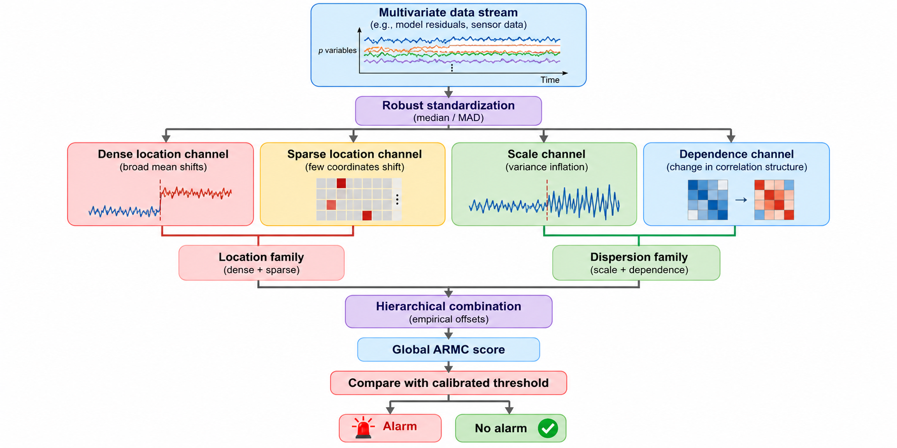

# ARMC v3.1

This repository contains the implementation and reproducibility code for the **Adaptive Robust Multiscale CUSUM (ARMC) v3.1** procedure.

ARMC is a sequential monitoring method for high-dimensional data streams. It combines four monitoring channels for **dense location**, **sparse location**, **scale**, and **cross-coordinate dependence** changes. The channels are combined hierarchically to produce a global monitoring score, which is compared with an empirically calibrated threshold.

  

  <em>Overview of the ARMC v3.1 procedure.</em>

## Code

### Main method

- `armc_v31.py` — Standalone implementation of ARMC v3.1.
- `core_v3.py` — Core CUSUM and simulation utilities.
- `methods_v3.py` — ARMC v3 method components.
- `methods_v3_1.py` — ARMC v3.1 scale and dependence components.
- `production_common.py` — Shared simulation settings, scenarios, and utilities.

### Simulation and diagnostics

- `run_expA_v31_only.py` — Matched-false-alarm-rate power experiment.
- `run_expB_v31_only.py` — Threshold-transport experiment.
- `run_ablations_v31.py` — Component-ablation experiments.
- `run_power_curves.py` — Power-curve experiments.
- `run_sparsity_grid_final.py` — Sparsity experiments.
- `run_stress_ghi.py` — Additional stress tests.
- `task8_correlation_sanity_and_curve.py` — Correlation-change checks and power analysis.
- `diag_task1_heavytail.py` — Heavy-tail and contamination diagnostics.
- `diag_task1_cusum_level.py` — CUSUM-level diagnostics.

### Paper output

- `make_paper_tables.py` — Generates numerical summaries for the manuscript tables.
- `make_paper_figures.py` — Generates simulation figures for the manuscript.

### Waymo application

- `waymo_pb_lite.py` — Reads Waymo Scenario TFRecord files.
- `run_waymo_pipeline.py` — Constructs trajectory residuals and applies ARMC v3.1.
- `primary_analysis_10shard.py` — Primary ten-shard leave-one-shard-out analysis.
- `make_primary_figures_10shard.py` — Generates figures for the Waymo analysis.

